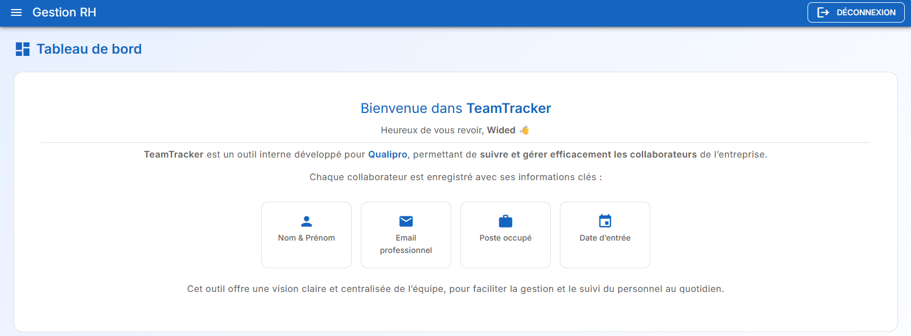
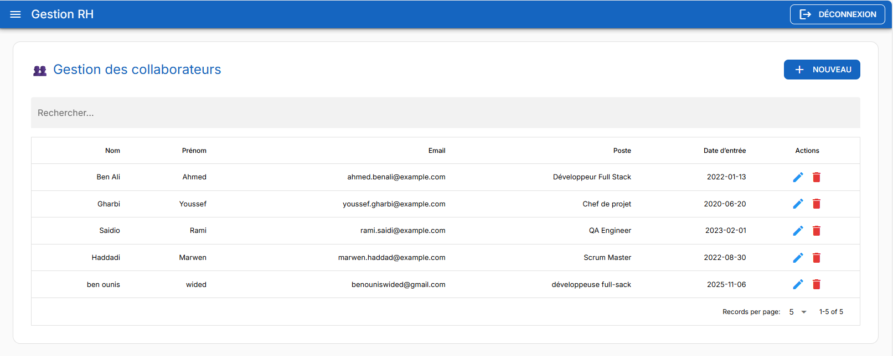
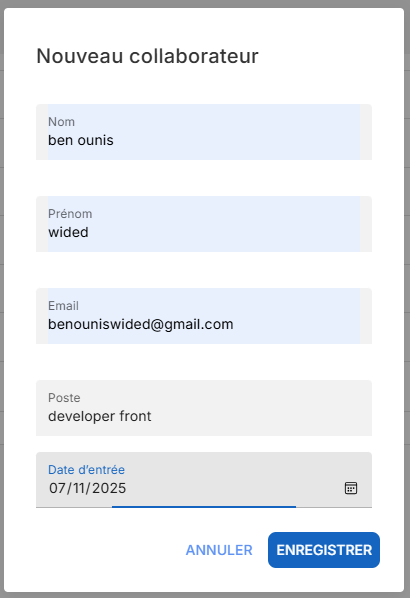
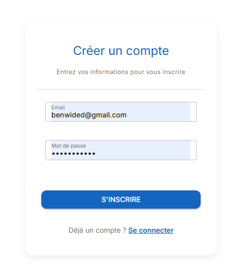
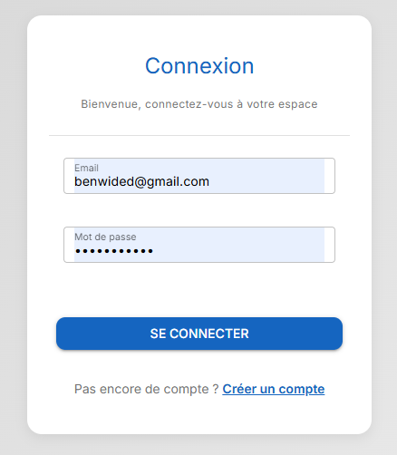

# 🧭 TeamTracker

> Une application interne simple et moderne pour suivre les collaborateurs d’une entreprise.  
> Projet réalisé avec **Vue.js (Quasar)** pour le frontend et **Express.js (Sequelize + MySQL)** pour le backend.  
> 🔐 **Bonus ajouté :** module d’authentification (login & register) avec JWT.

---

## 🧩 Contexte du projet

L’entreprise souhaite disposer d’un outil interne permettant de gérer la liste des collaborateurs.  
Chaque collaborateur possède :

- 👤 Nom  
- 🧾 Prénom  
- ✉️ Email  
- 💼 Poste (ex : Développeur, Chef de projet, Designer…)  
- 📅 Date d’entrée dans l’entreprise  

L’application **TeamTracker** permet d’effectuer les actions suivantes :

✅ Lister les collaborateurs  
✅ Ajouter un collaborateur  
✅ Modifier un collaborateur  
✅ Supprimer un collaborateur  
✅ (Bonus) Authentification utilisateur  

---

## 🛠️ Stack technique

### 🖥️ Frontend
- [Vue.js 3](https://vuejs.org/)  
- [Quasar Framework](https://quasar.dev/) (UI Components + Layout)  
- [Vue Router](https://router.vuejs.org/)  
- [Axios](https://axios-http.com/) pour la communication avec l’API

### ⚙️ Backend
- [Node.js](https://nodejs.org/)  
- [Express.js](https://expressjs.com/)  
- [Sequelize ORM](https://sequelize.org/)  
- [MySQL / MariaDB](https://www.mysql.com/)  
- [JWT](https://jwt.io/) pour l’authentification

---

## 📁 Structure du projet

TeamTracker/
│
├── frontend/ # Application Vue.js + Quasar
│ ├── src/
│ ├── public/
│ └── package.json
│
├── backend/ # API Node.js + Express
│ ├── models/ # Modèles Sequelize
│ ├── routes/ # Routes REST
│ ├── controllers/ # Logique métier
│ ├── config/ # Connexion à la base de données
│ ├── server.js # Point d’entrée du serveur
│ └── package.json
│
└── README.md

---

⚙️ Installation & Exécution
1️⃣ Cloner le dépôt
git clone https://github.com/widedVUE/TeamTracker
cd TeamTracker

2️⃣ Accès et données de test

Pour tester l’application sans créer de compte, vous pouvez utiliser :

Email : benouniswided@gmail.com

Mot de passe : qualipro123

💾 Importer la base de données

Ouvrez phpMyAdmin (XAMPP) ou un client MySQL.

Créez une base vide nommée qualipro_db (ou adaptez le .env).

Importez le fichier SQL fourni (qualipro_db.sql) envoé :

Dans phpMyAdmin, sélectionnez la base, cliquez sur Importer, choisissez le fichier .sql et validez.

✅ Toutes les tables et données seront recréées pour correspondre à l’application.

3️⃣ Configuration du backend
cd backend
npm install

Créer un fichier .env à la racine du backend :

PORT=5000
DB_HOST=localhost
DB_PORT=3306
DB_NAME=qualipro_db
DB_USER=root
DB_PASS=
JWT_SECRET=une_cle_secrete_pour_jwt225
JWT_EXPIRES_IN=1d

Lancer le serveur :

npm start

L’API sera accessible sur : http://localhost:5000

4️⃣ Configuration du frontend
cd ../frontend
npm install
npm run dev

L’application sera disponible sur : http://localhost:9000

🧪 API REST Endpoints
Méthode	Endpoint	Description
GET	    /api/collaborateurs	Récupère tous les collaborateurs
POST	/api/collaborateurs	Ajoute un nouveau collaborateur
PUT	    /api/collaborateurs/:id	Met à jour un collaborateur
DELETE	/api/collaborateurs/:id	Supprime un collaborateur
🧠 Fonctionnalités principales

📋 Liste des collaborateurs avec un tableau dynamique

➕ Ajout d’un collaborateur via un formulaire

✏️ Modification d’un collaborateur existant

❌ Suppression avec confirmation

💅 Interface moderne et responsive (Quasar)

🔐 Authentification JWT (login & register)

## 🖼️ Aperçu

> 📂 Toutes les captures d’écran sont situées dans le dossier [`/screenshots`](./screenshots)

Voici un aperçu visuel de l’application **TeamTracker** 👇

### 🎨 Tableau de bord

### 👥 Liste des collaborateurs

### ➕ Formulaire d'ajout collaborateur

### 📄 Page d'inscription

### 🔐 Page de connexion

🧰 Scripts utiles
🔹 Frontend
# Démarrer le serveur de développement
quasar dev

# Générer le build de production
quasar build

🔹 Backend
# Démarrer le serveur
npm start

# Synchroniser les modèles Sequelize (si nécessaire)
npm run sync

👩‍💻 Auteur

Wided Ben Ounis
Développeuse Full Stack JavaScript
📧 benouniswided@gmail.com

💼 GitHub